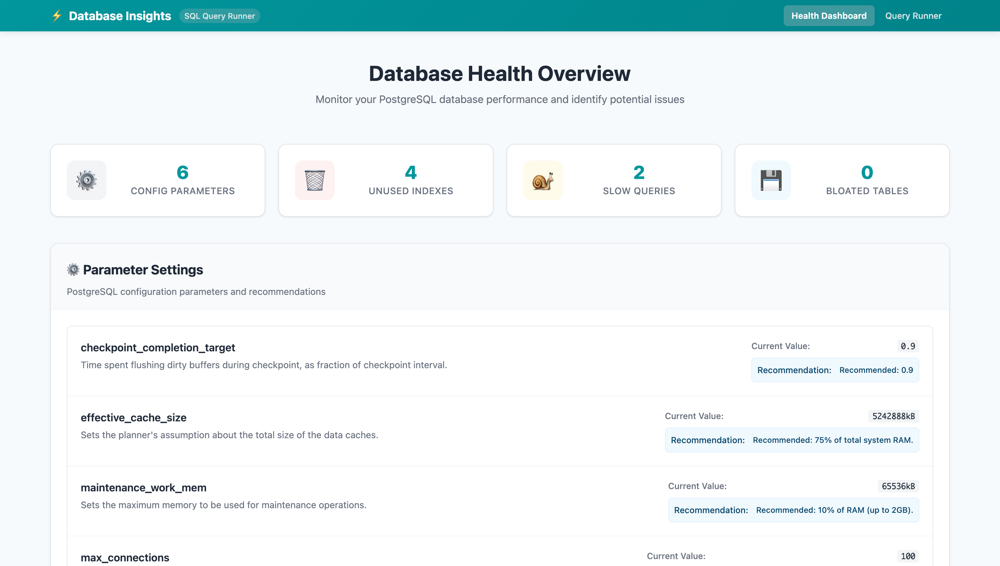
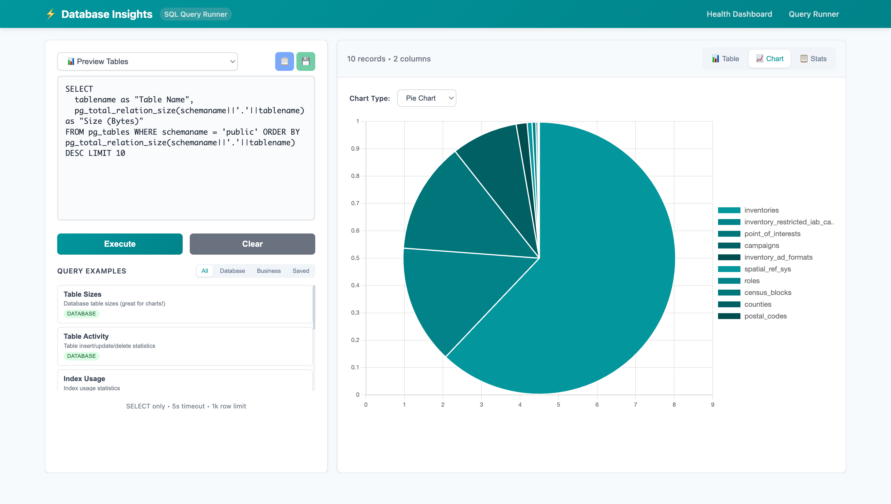

# 📊 PgInsights

> PostgreSQL performance monitoring for Rails apps

<div align="center">

[](https://badge.fury.io/rb/pg_insights)
[](https://github.com/mezbahalam/pg_insights/actions/workflows/ci.yml)
[](https://opensource.org/licenses/MIT)

</div>

---

PgInsights is a Rails engine that gives you a web dashboard for monitoring your PostgreSQL database performance. Think of it as a lightweight alternative to external monitoring tools that lives right inside your Rails app.

## 🤔 Why I built this

I got tired of switching between different tools to check database performance. Sometimes you just want to quickly see which indexes aren't being used, or find slow queries without setting up a whole monitoring infrastructure. 

PgInsights gives you that - a simple dashboard you can access at `/pg_insights` in your Rails app.

## 🎁 What you get

<table>
<tr>
<td width="50%">

### 🏥 Health Dashboard
- Find unused indexes that are wasting space
- Spot tables that might need indexes (high sequential scans)
- Identify slow queries (if you have pg_stat_statements enabled)
- Check for table bloat that needs cleanup
- Review PostgreSQL configuration settings

</td>
<td width="50%">

### 🔍 Query Runner  
- Run your own SELECT queries safely
- Built-in queries for common performance checks
- Save queries you use frequently
- Results displayed as tables or charts

</td>
</tr>
</table>

### ⚡️ Smart execution
- Runs health checks in background jobs if you have them set up
- Falls back to running directly if you don't
- Caches results so repeated visits are fast
- Configurable timeouts to prevent slow queries from hanging

## 📸 Screenshots

<details>
<summary>👀 Click to see the interface</summary>

### Health Dashboard
Monitor your PostgreSQL database performance and identify potential issues at a glance.



### Query Runner
Run custom queries and visualize results with built-in charting capabilities.



</details>

## ⏩ Quick Start

Add to your Gemfile:

```ruby
gem 'pg_insights'
```

Run the installer:

```bash
bundle install
rails generate pg_insights:install
rails db:migrate
```

That's it. Visit `/pg_insights` in your browser.

## ⚙️ Configuration

The engine works out of the box, but you can customize it:

```ruby
# config/initializers/pg_insights.rb
PgInsights.configure do |config|
  # Run health checks in background (default: true)
  config.enable_background_jobs = true
  
  # How long to cache results (default: 5 minutes)
  config.health_cache_expiry = 10.minutes
  
  # Timeout for health check queries (default: 10 seconds)
  config.health_check_timeout = 15.seconds
  
  # Queue name for background jobs (default: :pg_insights_health)
  config.background_job_queue = :low_priority
end
```

## 🔄 How Background Jobs Work

> **Note:** PgInsights uses on-demand background jobs, not automatic scheduling.

**When health checks run:**
- ✅ When you visit the health dashboard `/pg_insights/health` and cached data is older than `health_cache_expiry` (default: 5 minutes)
- ✅ When you click the "Refresh" button in the dashboard  
- ✅ When you run `rails pg_insights:health_check` manually
- ❌ **NOT automatically** - PgInsights doesn't run background jobs on its own

**How caching works:**
```
Visit at 2:00 PM → Runs health checks, caches results for 5 minutes
Visit at 2:03 PM → Uses cached results (still fresh)  
Visit at 2:06 PM → Data is stale, triggers new background jobs
```

**Background job setup (optional but recommended):**

If your app has background jobs (Sidekiq, Resque, etc.), PgInsights will use them for better performance:

```bash
# Check if background jobs are working
rails pg_insights:status
```

**Without background jobs**: Health checks run synchronously when you visit the page (slower but works)  
**With background jobs**: Health checks run asynchronously (faster, non-blocking)

**Optional: Automatic recurring checks**

If you want health checks to run automatically (not just on-demand), set up a scheduler:

```ruby
# Using whenever (runs every hour)
every 1.hour do
  runner "PgInsights::RecurringHealthChecksJob.perform_later"
end

# Using sidekiq-cron
Sidekiq::Cron::Job.create(
  name: 'PgInsights Health Checks',
  cron: '0 * * * *',
  class: 'PgInsights::RecurringHealthChecksJob'
)
```

**Note**: Even with automatic scheduling, the jobs are smart - they only run expensive queries if the cached data is actually stale.

## 💻 Usage

Navigate to `/pg_insights` in your app. The interface is pretty straightforward:

| Page | What it does |
|------|-------------|
| **Main page** | Run queries and see results as tables or charts |
| **Health tab** | Database performance overview |
| **Query examples** | Pre-built queries for common checks |

All queries are read-only (SELECT statements only) and have timeouts to prevent issues.

## 🛠️ Available rake tasks

```bash
rails pg_insights:status        # Check configuration
rails pg_insights:health_check  # Run health checks manually
rails pg_insights:stats         # Show usage statistics
rails pg_insights:clear_data    # Clear stored data and caches
```

## 🔒 Safety

- Only SELECT queries allowed
- Query timeouts prevent long-running queries
- Focuses on public schema by default
- No modification of your data

## 🗑️ Uninstalling

```bash
rails generate pg_insights:clean
# Remove gem from Gemfile
```

## 📋 Requirements

- Rails 6.1+
- PostgreSQL
- For slow query detection: pg_stat_statements extension (optional)

## 🤝 Contributing

Found a bug or have an idea? Open an issue or send a pull request. The codebase is pretty straightforward.

**Development setup:**

```bash
git clone https://github.com/mezbahalam/pg_insights.git
cd pg_insights
bundle install
bundle exec rake spec
```

## 📄 License

MIT License. See [LICENSE](MIT-LICENSE) file.

---

<div align="center">

Built by [Mezbah Alam](https://github.com/mezbahalam) • Inspired by pg_hero and other database monitoring tools

</div>
